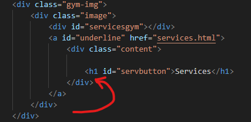
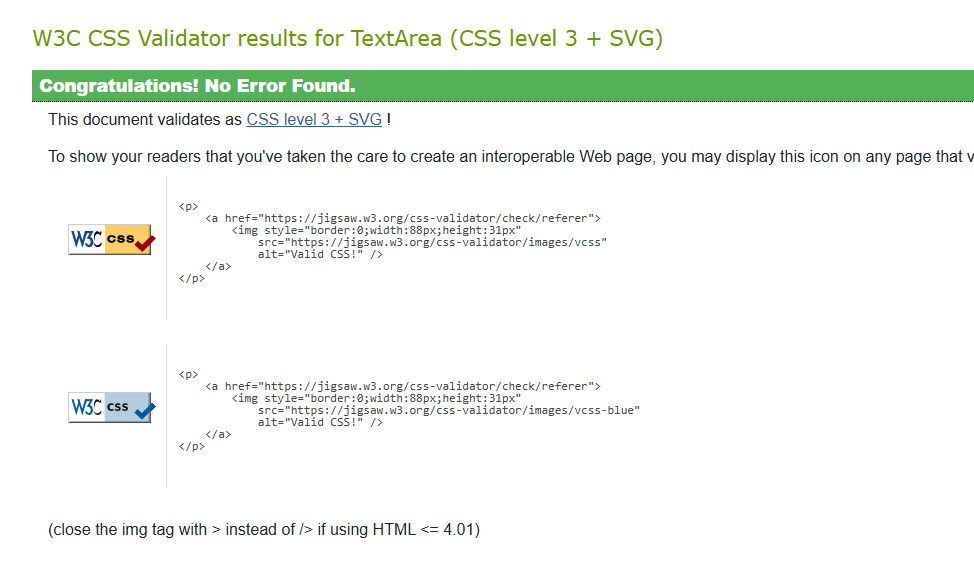

<h1 align="center">
Grand Gym - Fitness Redefined

  
</h1>

[Link for the website](https://bartdamian.github.io/Project_1/)

Welcome to Grand Gym, your ultimate fitness destination! Whether you're a seasoned athlete or just starting your fitness journey, Grand Gym is here to provide you with the resources, community, and support you need to reach your goals.

Our website offers easy access to everything you need to know about our facilities, the benefits it offers for your health and a gallery of images with various equipment that we offer for you to try. From state-of-the-art equipment to expert trainers, Grand Gym is designed to help you get stronger, healthier, and more motivated every day.

At Grand Gym, we believe that fitness is more than just a routine—it's a lifestyle. Join us today and become part of a community that's dedicated to pushing limits, supporting one another, and celebrating every achievement, big or small.

Let's get started on your journey to greatness!

<h2>Table of Contents</h2>

- [User Experience (UX)](#Grand-Gym-UX)

- [Features](#Features)

- [Design](#Design)

- [Technologies Used](#Technologies)

- [Testing](#Testing)

- [Deployment](#Deployment)

- [Credits](#Credits)

<H2 align="center">Grand Gym UX</H2>

**UX Considerations**

<h3 align="center"> Strategy</h3>

The websites main target audience will be people that are looking to improve their life style and health, hence why I've provided the benefits of what the facilities could help the user with. Although the audience could range from teens to adults that are just looking for something to get into.

- As a user I want to be able to find the location of the facility without any issue.

- As a user I want the information provided to be accurate.

- As a user I want to be able to find the opening times easily to plan ahead.

- As a user I want to access the website without encountering any issues while clicking on links on the page and opening new tabs.

**The main objective of the website**

Is to provide information on what the Gym has to offer and what benefits the user could gain from it while also being able to easily navigate through the website and access the information easily.

<H1 align=center>Features</H1>

Grand Gym’s website is designed to provide an intuitive, streamlined experience for users—whether they’re gym members, prospective clients, or fitness enthusiasts looking for information. The UX focuses on accessibility, ease of use, and a clean, motivational design. The primary goal is to keep users engaged while facilitating their fitness goals.

**<h4>1. Homepage</h4>**

Goal: Provide users with a quick, engaging snapshot of the gym and a short motivational sentence.

<h4>Key Features:</h4>

Hero Section: Large, visually engaging banner with a Contact us button and motivational speech to get you motivated.

<h4>Navigation:</h4> A fixed top navigation bar with options like:

- Home
- Services
- Memberships
- Gallery

Potential features that could be added later as I gain more knowledge of the technologies used and free time.

- Blog

- Contact

- User Profile (if logged in)

The homepage offers the user to quickly navigate to services tab by clicking on the hoveron image under the main image, as well as a Opening times table which shows the user the day and time that the facilities open up and close.

The footer provides them with necessary contact information the address and the social links.

**<h4>2. Services</h4>**
Goal: Make it simple for users to find and read on what the Gym has to offer and what benefits those activites or that specific facility has to offer.

Key Features:

- List of the things that would catch most peoples attention (e.g Sauna, Swimming Pool, Staff Training and Boxing Facilities.)

- Clear and responsive design for all devices and screens.

- List of benefits that our facilities have to offer
  
UX Consideration: Keep the booking process simple with minimal steps and an option for users to save their favorite classes for future sign-ups. Integrate calendar syncing for a seamless experience.

**<h4>3.Gallery</h4>**

Goal the Gallery page is to provide the user with photos of what the gym has to offer in terms of equipment and possible classes that could take place whilst you are attending the Gym.

The key features:

- Pictures laid out in a column to offer best quality and easy responsivess for every screen.

- The pictures have a slight zoom in effect on them when hovered over which offers more interactivity.

**<h4>4.Membership</h4>**

Goal of this page is for the user to be able to register and provide information on which the client would contact them shortly after to provide with nessary information, however the user will also receieve an email which includes all the information they would like to know. This page also offers the user with the google maps preview of the location for quick and easy navigation.

<h2 align="center">Potential features that could be added in the future</h2>

<h4>1. Mobile Experience</h4>
Goal Provide an optimized experience for users accessing the website from their mobile devices
 

Key Features:

- App-Like Interface: Consider adding mobile-specific features like swipe navigation, push notifications, and access to the mobile shop.

<h4>2. Contact & Support Page</h4>
Goal: Offer users a way to get in touch for support, inquiries, or feedback.
 

Key Features:

- Contact Form: Add a form that allows you to contact us about general inquiries.
  
- FAQs: A well-organized FAQ section to address common questions about membership, bookings, classes, etc.
 
<h4>3. Trainer Profiles</h4>
Goal: Build trust and connection by showcasing the gym's trainers, their expertise, and availability.
 

Key Features:

- Trainer Bios: Include professional background, fitness philosophy, and areas of expertise.

- Availability: Clear display of the trainer’s schedule and availability for one-on-one sessions.

- Personalized Training Plans: Option to book a consultation for a tailored training plan.

- Member Feedback: Allow members to leave reviews or ratings based on their experience with each trainer.

- UX Consideration: Profile pages should be simple, with high-quality images and concise, engaging bios. The booking process should be integrated directly into the trainer profile for quick access.

Conclusion
The UX for Grand Gym focuses on creating an intuitive and motivational environment that empowers users to easily navigate their fitness journey. From finding and booking classes to tracking progress, the goal is to minimize friction, increase engagement, and keep users coming back to reach their goals.

<h1 align=center>Design</h1>

**<h3>Navigation Bar</h3>**

The navigation bar has a consistent look and placement on all four pages of the website supporting easy navigation. It includes a simple Logo, Home page, Gallery page, Services and Membership sign up page all the navigation bars are responsive on multiple screen sizes. On smaller screen sizes the Logo moves all the way to the left and the navigation bar changed to a drop down menu which is placed on the right.
 

**<h3>Main Image</h3>**

* The main image includes a photograph with a grediant of the main [colors] used for the website with a motivational speech that is placed on a transparent background.
* This part also features a "contact us" button which leads the user to the Membership page which provides them with all the neccessary information an easy sign up page and location of the gym.
 
**<h3>Services Image</h3>**

This image acts as a button that appears when the user hovers over the image and it displays the text "Services" and lowers the opacity of the background image for the text to stand out more it's main point is to lead the user to the services page and give the website some extra interactivity.
 
 
**<h3>Opening Times</h3>**

Small and interactive table thats easy to acces on the main page and provides all the information on what day the gym's open and around what time it closes.
 
 

**<h3>Footer</h3>**
Simple footer with all the neccessary information and links to our social media pages, the colours used draw your attention to the "Contact us" text which uses  the "Zen Tokyo Zoo" font which feels bold and energetic and it seems fitting for a gym.
 
 

**<h3>Services Page</h3>**

The Services page effectively combines images with structured text, It uses:

- A bold, energetic color palette

- Clean two-column alignment, for easy responsivess across all screens and devices.

- Strategic text styling for readability and impact.

When adjusted to mobile phone size, the images and text changes to a single column for better mobile view.
 
  

**<h3>Gallery Page</h3>**

This Gallery page uses a minimalist, bold grid layout that:

- Focuses on showcasing gym activities and equipment

- Uses strong contrast and spacing for modern design

- Maintains brand continuity with the neon green heading.

When adjusted to mobile phone view, the images adjust to a single column for better mobile view.
 

**<h3>Membership page</h3>**

This is a visually striking, purpose-driven contact page that:

- Leverages bold imagery and neon brand colors

- Offers a simple sign-up form

- Embeds a location map for real-world orientation

 

**<h3>Design Tone & Mood</h3>**

- The bright neon green gives the site an energetic, intense vibe — great for a gym brand.

- The dark backgrounds help make the neon pop, and the overlay technique on images keeps text readable without being too disruptive.

- Colors evoke motivation, alertness, and high energy environments which fits a gym’s purpose well.

 
 
 

**<H3>Wireframes</H3>**

Index.html 

Services.html

Gallery.html

Booking-form.html

<h1 align=center>Technologies</h1>

**Languages used**

**Libraries & Programs Used**

* Google Fonts: was used to import the 'Play' and 'Zen Tokyo Zoo' fonts which were the only fonts used in my project.

* Font Awesome: was used to add icons for aesthetic the footer.

* Git: was used for version control by utilising the Gitpod terminal to commit to Git and Push to GitHub.

* GitHub: is used as the respository for the projects code after being pushed from Git.

* Balsamiq: was used to create the wireframes during the design process.

* Image Downscale websites were used to lower the resolution of the image

* Image converter was used to change the formats of the image to WEBP to lower their size.

 
 
 

<h1 align=center>Testing</h1>

**Validator testing**

**HTML**

Index.HTML

At first i've encoutered this issue on the Index.html page which I have solved by moving the div as shown in the image below

 
 
Services.HTML

Gallery.HTML

Booking-Form.HTML

 
 
 

**CSS**

Styles.css

 
 
 

**Lighthouse testing**

For the lighthouse testing Ive only really encountered 2 issues, 1 was the images were too high resolution which is why I've used apps to downscale them and change their format to WEBP. The other issue I've encountered was third party cookies for embeded google maps which lowers my best practices score, i've found out there is a different way of implenting the google maps which requires use of Java script which im not too sure how to use yet.

Here are my results from lighthouse testing:

<h1 align=center>Deployment</h1>

**How this site was deployed**

In the GitHub repository, navigate to the Settings tab, then choose Pages from the left hand menu

From the source section drop-down menu, select the Master Branch

Once the master branch has been selected, the page will be automatically refreshed whenever there is an update on any of the content provided in the repository.

Any changes pushed to the master branch will take effect after some time depending on how many changes were made and how big is the file.

**If you'd like to clone the repository here is a step by step:**

**Requirements:**
Git must be installed on your system
→ Check: git --version in your terminal
→ Download Git if not installed

A GitHub account (optional for public repos) however you will also not be able to make changes to the repositry and push them to github without an account.

* 1: Go to the Repository on GitHub
  
   - Open your web browser and go to the repository URL.
   - Example: https://github.com/username/repository-name
 
* 2: Click the Code Button
   - On the repository main page, click the green Code button A dropdown will appear.
     
  You will see multiple options:
   - HTTPS: e.g. https://github.com/username/repository-name.git
   - SSH: e.g. git@github.com:username/repository-name.git (for more advanced users)
   - GitHub CLI: if you're using GitHub's command-line tool
     
 * 3: Open Your Terminal or Command Prompt
   - Navigate to the folder where you want to place the project.

 * 4: Run the git clone Command
   - Paste the copied URL like this: git clone https://github.com/username/repository-name.git
  
You should now be able to open up the project in VSC.
 
 
 

<h1 align=center>Credits</h1>

**Code**

The code used for the text on hover clickable image on index.hmtl came from https://www.youtube.com/watch?v=uNTBTMoU9qs however I have adjusted parts of it to make it work for my project.

Some of the code Ive used was using the bootstrap mainly for the responsivness however ive also used it for the cards and table.

The code used for the gallery came from https://youtu.be/FcKksqdm97Q.

**Media** 

Most of my images came from pexels however I've also used unsplash.

     

     
  

